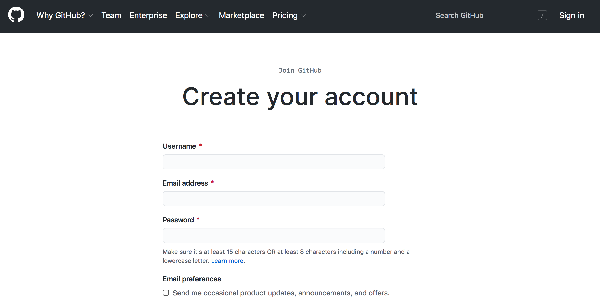

Setting up a GitHub Account
===========================

About GitHub
------------

GitHub is a repository hosting service. [MORE]

Basic GitHub Account Setup
--------------------------

To use GitHub, you need to make a (free) account. You can do so by going to 
[github.com](https://github.com/). Once you're there, click "Sign Up" in the 
top-right corner of the page. This should take you to a form, which asks you to 
enter a **username**, **email address**, and **password**.



After you've entered in this information (and completed a quick CAPTCHA), GitHub 
will make you an account. Then, the site will prompt you to complete an 
optional survey. Fill it out, or scroll to the bottom to skip it.

Either way, you'll need to then verify your email address. Go to your inbox and 
look for an email from GitHub. Click the "Verify email address" button. Doing so 
will take you to your homepage, where, if you'd like, you can add a few details 
about yourself.


You now have a GitHub account!

GitHub Desktop, or the Command Line?
------------------------------------

Remember that Git is separate from GitHub. The latter is a service that's been  
built around the former. One part of the services that GitHub offers is an 
application called [GitHub Desktop](https://desktop.github.com/), which allows 
users to manage their repositories with a point-and-click graphical user 
interface (or GUI). Ultimately, it's a matter of preference whether you use the 
GUI or stick with the command line for your own projects (and often, you might 
end up using a little of both), but for this workshop, we will interact with 
GitHub via the command line. One of the primary reasons for this has to do with 
the fact that not every computer you interact with will have GitHub's GUI 
installed---or even have a screen! Many remote servers offer command line-only 
access, and if you ever want to sync your files on these machines, you'll need 
to do so without GitHub Desktop. Luckily, GitHub seamlessly extends Git commands, 
so using the service without the GUI is, as we'll see, quite straightforward.

Locally Setting Up Your Account Credentials
-------------------------------------------

Regardless of how you make your commits, you will need to use the command line 
to do one bit of setup. In either Terminal (Mac) or Git Bash (Windows), enter 
the following commands to associate your name and email with the commits you 
make (note: you do not need to use your GitHub username):

```
git config --global user.name "<your name>"
git config --global user.email "<your email>"
```

You can check whether this was successful by simply calling either, or both, of 
the following:

```
git config --global user.name
git config --global user.email
```

These two commands should echo back the information you've just entered.
