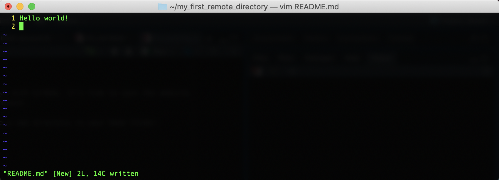
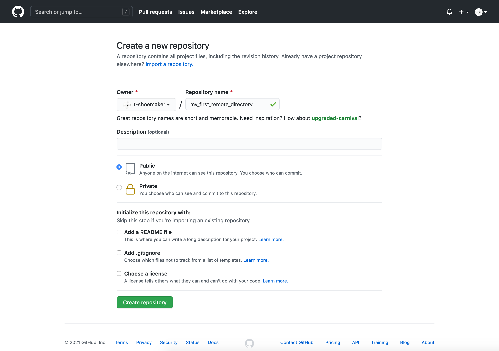
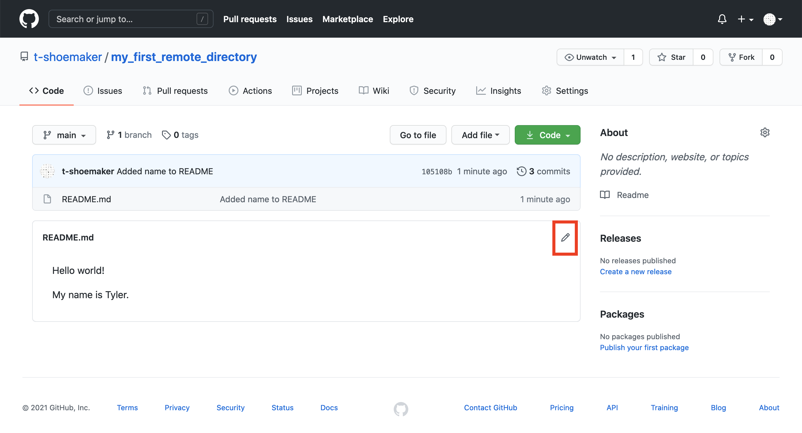

Pushing a Repository
====================

Now that you're all set up with GitHub, it's time to sync the website with a 
local repository on your computer.

Making a Test Repository
------------------------

First, use the command line to make a new directory in your Home folder:

```
mkdir ~/my_first_remote_directory
```

Put this directory under version control with Git:

```
cd ~/my_first_remote_directory
git init
```

With Vim, make a README markdown file:

```
vim README.md
```

Write and save "Hello world!" in the file. You should see something like the 
following:



Exit Vim. Then, add README.md to Git and commit your changes. Don't forget to 
write a short note in the commit message.

```
git add README.md
git commit -m 'Add a README file'
```

You should see the following:


Preparing to Sync Your Repository
---------------------------------

So far so good! All we've done is repeat the normal workflow for putting files 
under version control. But now we need to step away from the command line for 
a moment and prepare a space for receiving this repository on GitHub.

To do so, go to github.com and, on your homepage, click the "Create repository" 
button. You'll be taken to this page:


There are a few things of note here:

* Repository name: your repository's name, which should be the same as what's on your computer
* Description: a short (1-2 sentence) explanation of what's in this repository
* Public/private setting: repositories may be either "public" (viewable by anyone) or "private" (only viewable by you and those to whom you grant access)
* Initialize with details, including:
  * A README file: a form of documentation; provides information about the files in the repository
  * A .gitignore file: instructs Git to ignore specific files or filetypes
  * A license: governs the use or redistribution of your files
  
Because we're initializing this repository from an existing directory, we won't 
bother with most of the extra details. But we do need a title, which should be 
the same as what's on your local computer ("my_first_remote_directory"). A 
description is helpful but not necessary for our purposes; the same goes for a 
license. Finally, we will choose to make this a public repository (meaning 
anyone can see it).



Pushing a Local Repository
--------------------------

Once you've entered the above information, click "Create repository." GitHub 
will take you to a new screen, which gives you a number of options for making or 
uploading new files to the repository.


Since we already have a repository made, we need to use the "Push an existing 
repository from the command line." Pushing our repository is as easy as 
sequentially entering into the command line the three commands GitHub provides.

```
git remote add origin git@github.com:<your user account>/my_first_remote_directory.git
git branch -M main
git push -u origin
```

On the command line, that looks like this:


To summarize the above, we've done the following:

1. Associated GitHub's remote repository with our local repository (`git remote` etc.)
2. Made a new branch in our local repository called "main" (`git branch -M main`)
3. Pushed the contents of main (from `origin`) to a new, corresponding remote branch on GitHub

From here on out, when you want to update the remote repository with further 
changes, you can simply use the shorthand `git push` after the usual save, add, 
commit steps. Importantly, Git will only update the branch you're on when you 
enter `git push`, so before making any pushes, it's a good idea to run a quick 
`git status` command to make sure you're on the branch you want to be on.

When you make your changes, the GitHub site won't immediately refresh itself, 
but if you click on the "< > Code" tab or on the name of the directory, you'll 
see that the repository has been synced and your README.md file is now online.


Note that GitHub automatically looks for a README file in your repository. If it 
finds one that contains renderable [markdown](https://guides.github.com/features/mastering-markdown/) code, it will 
render the file on your repository's main page. (More information about writing 
effective README files is available through the DataLab's data documentation 
[workshop](https://ucdavisdatalab.github.io/workshop_how-to-data-documentation/).)

Tracking Files Remotely
-----------------------

With this repository made, GitHub can start tracking changes you make to your 
files, much as Git does locally. The process works exactly like the one you 
do for Git, though it requires one more step.

First, we'll alter our README.md. Reopen the file with vim, skip a line down 
from the line you've already written, and add "My name is <your name>." Save and 
quit.


Then, add the file and commit your changes.


If you want to push these changes to your remote repository, simply enter `git push`. 
You'll see a similar message appear about enumerating, counting, and writing 
objects to GitHub. Afterwards, if you refresh your file on GitHub, you should 
see your changes:


Note that your commit message appears here as well:


If you click the commit tag:


You'll be taken to another page, which shows you the differences between your 
old version and the new one:


Pulling Changes from a Remote Directory
---------------------------------------

Before moving on, it's also worth noting that we can pull changes directly from 
GitHub. If a file has been altered on the remote version of a project, GitHub 
offers functionality for syncing that file with your local copy (or creating a 
new file altogether, if need be).

For example, if you return to the main page of "my_first_remote_directory", you 
can alter the README directly on GitHub. Click the pencil in the right-hand 
corner of the rendered file.



This will open up a text editor interface. Using it, add "What's yours?" on the 
fifth line of the document. The complete document should look like this:

```
Hello world!

My name is <your name>

What's yours?
```

Scroll to the bottom and click the green "Commit changes" button. This is the 
equivalent of doing `git add <file>` and `git commit -m <message>` on the 
command line.

You'll see something like the following:


Back on the command line, if you type `git status`, you'll see that your local 
repository is now out of sync.


If you haven't made any changes to your directory, syncing it with the remote 
version can be achieved with a straighforward pull command:

```
git pull
```

Once you enter this command, your command line should look something like this:


Your files are now synced. A later portion of this reader will discuss how to 
handle this process when you _have_ made changes to your directory between the 
time the remote was altered and the time you go to make a pull.