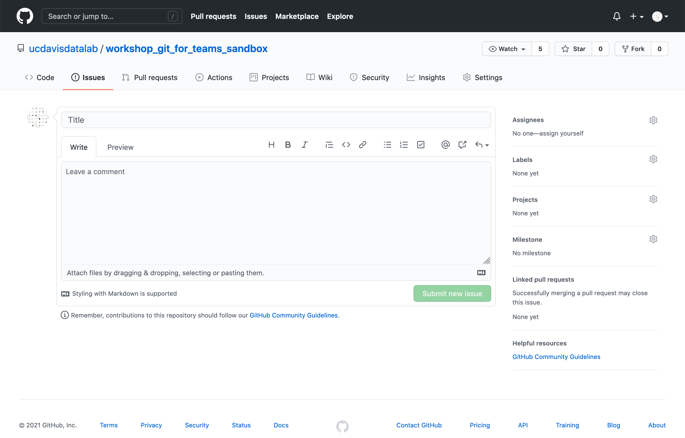
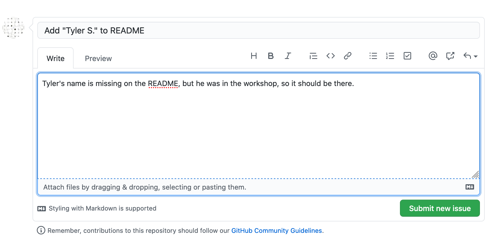
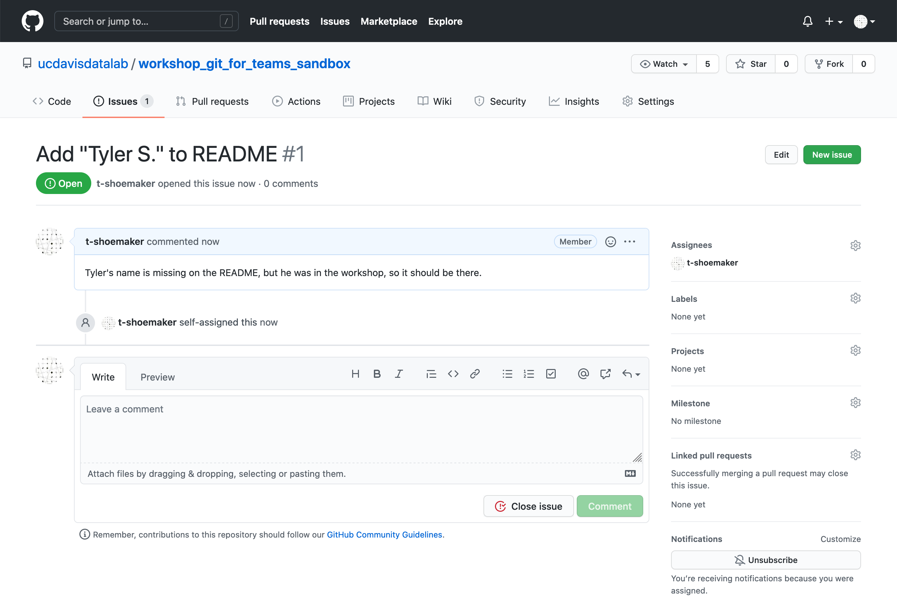
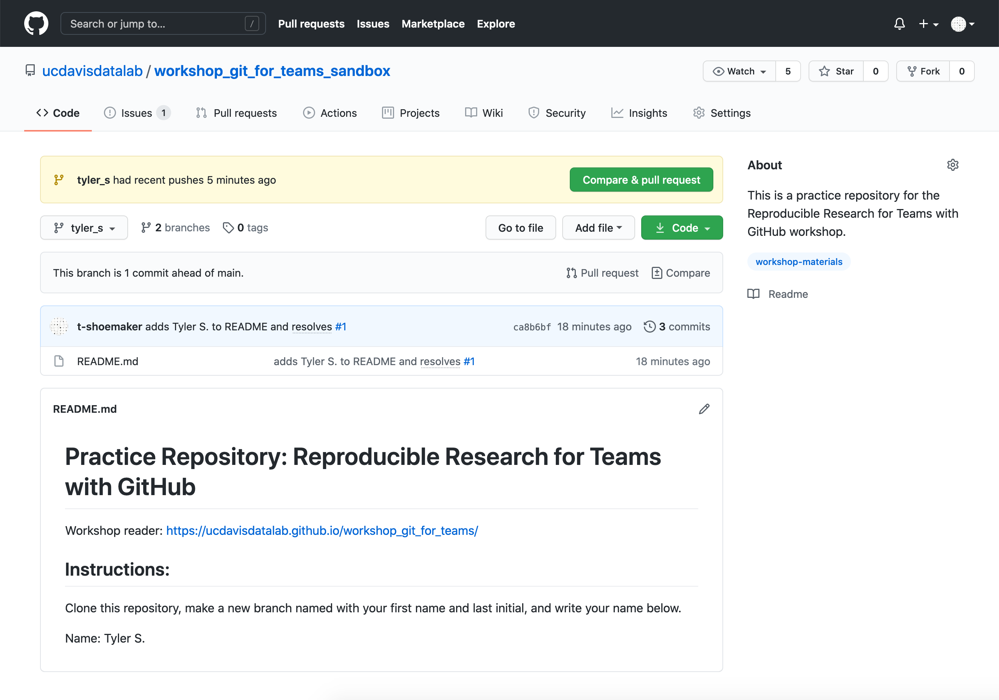

Opening Issues and Making Changes
=================================

You've made a branch! It's now possible to make changes to the cloned repository 
without stepping on the toes of your team members. However, it would be helpful 
to communicate with your team and tell them what you're working on.

About Issues
------------

On GitHub, one of the primary ways we do this is through **Issues**. Issues are 
the basic unit of project management on GitHub: they're used for reporting bugs, 
keeping track of tasks, and requesting project enhancements. _Scope_ is important 
for issues: an issue should address a specific bug or a discrete task, which a 
team member can then work on. Examples might include:

* add an "About Us" button to a website navigation bar
* following a recent directory restructure, filepaths need to be rewritten
* fix the encodings of a source file
* update README to include new information about recent changes

Issues contain the following parts:

* A title: a brief summary of the task, bug, or request
* A description: space for additional information about the task, bug, or request
* Assignees: information about which team member is working on the issue
* Labels: projects might ask team members to specify an issue type with a tag (e.g. "bug", "enhancement")
* Milestones: teams can set larger goals for a project, of which a given issue might be a part
* Comments: space where team members can discuss issues

Typically, a team member will **open** an issue, enter the above information, 
and begin working on whatever task that issue requires. When they're finished, 
the team member will **close** the issue, which lets others know that that 
task has been completed.

You can read more about GitHub issues [here](https://guides.github.com/features/issues/).

Opening an Issue
----------------

Before we make any changes to our cloned repository, let's open an issue. Go to 
the "Issues" tab at [https://github.com/ucdavisdatalab/workshop_git_for_teams_sandbox](https://github.com/ucdavisdatalab/workshop_git_for_teams_sandbox) 
and click the green "New issue" button. It should take you to the following page: 



You'll be adding your name to the repository's README.md file. Your issue's 
title should reflect this task.



With this information entered, assign yourself to this issue:

<center>

</center>

Click the green "Submit new issue" button. GitHub will take you to a new page:



Making Changes
--------------

With your issue open, it's now time to make your changes.

In the command line, open the README.md file with Vim. Go to line 12 and enter 
your first name and the first initial of your last name.


Save the file and quit Vim. Add the file to the Git staging area with `git add`.

From here, you can commit the file as you normally would. But since you're 
working on a specific issue, it would be helpful to reference that issue in your 
commit message. That way, your team can associate specific changes made to a 
project with the issues that discuss those changes.

GitHub makes tracking issues easier by assigning each issue a number. In the 
example above, "Add 'Tyler S.' to README" is issue #1 (yours will be something 
different). To reference this issue in a commit, simply type the issue number in 
the commit message:


Pushing Changes on a Branch
---------------------------

To see how GitHub makes reference to this commit, we'll need to push our changes. 
But if you try `git push` from here, you'll get the following error message:


Here, Git is telling you that the remote repository doesn't have a branch to 
associate your changes with; you've made a _local_ branch, but that doesn't 
automatically create a _remote_ branch. We can see what branches are 
available on the remote repository with `git branch -a`:


The text in green lists local branches, while the red text lists remote 
branches. The "->" arrow that points from a red remote with a green local tells 
you which remote branch your own main branch is synced with.

From this list, you can see that the remote repository doesn't have your branch. 
You'll need to push it.

To do so, type the following into your command line:

```
git push --set-upstream origin <branch-name>
```

There's also a bit of shorthand for this command:

```
git push -u origin <branch-name>
```

(Note: here "origin" references your local repository.)

Once you press "Enter", you should see something like this:


Now, if you type `git branch -a`, you'll see a remote copy of your branch. You 
can also visit the repository page on GitHub, where you'll see a notice that a 
branch has "recent pushes".


Click on the "branches" icon:


...and you'll see a list of branches.

If you click on yours, you'll see that this branch is "ahead" of the main branch 
by 1 commit. You'll also see that your change has appeared down in the README 
view. Finally, you'll see in the commit message view that the message has turned 
your issue number into a hyperlink.



Closing an Issue
----------------

Clicking on the hyperlinke will take you directly to the issue you created.