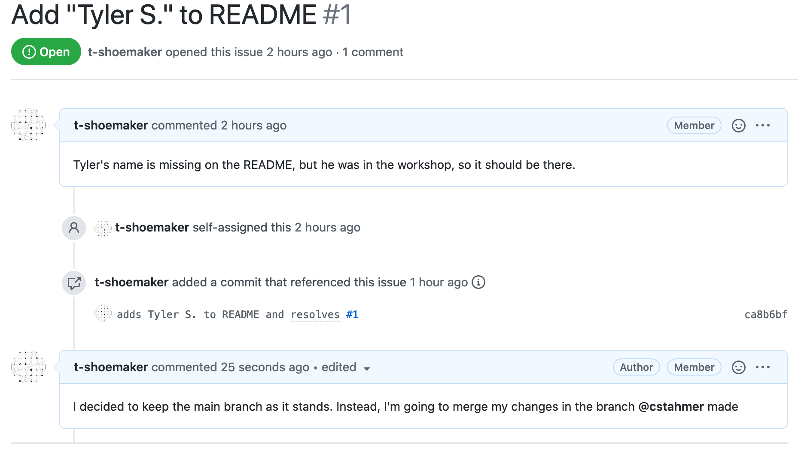
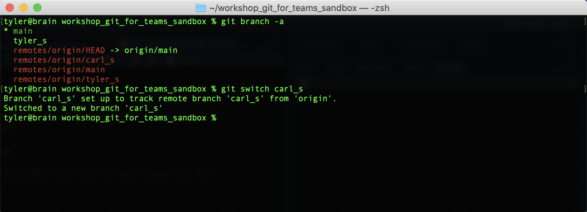
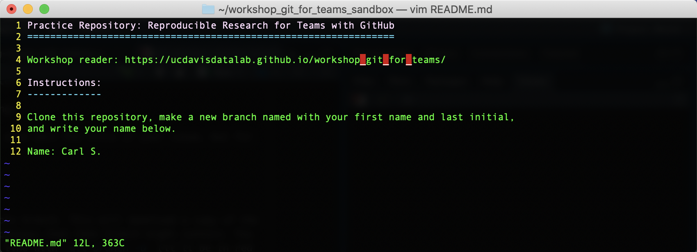
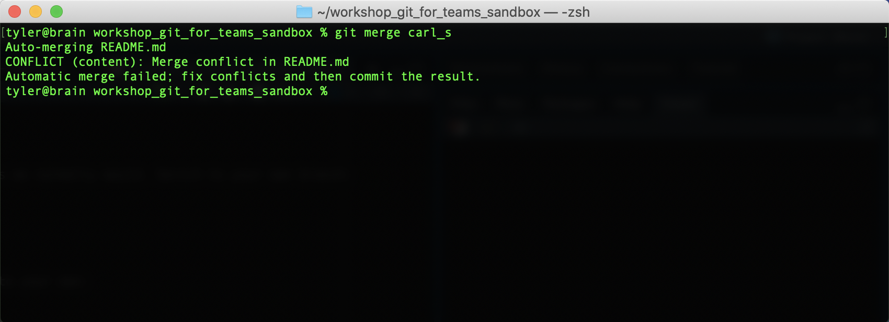
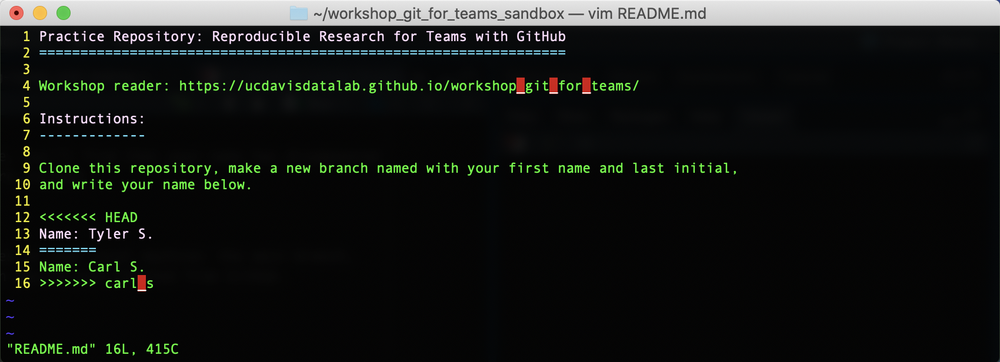
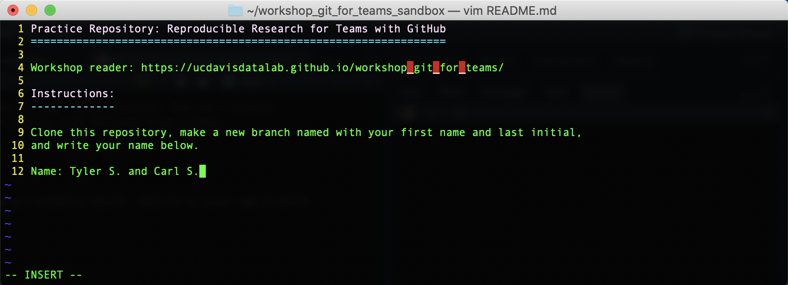
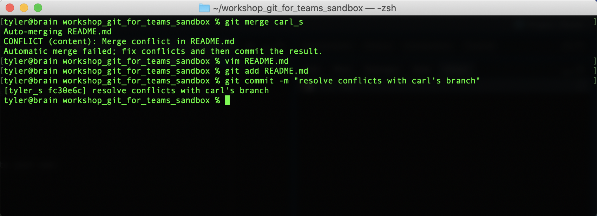

Merging Remote Branches
=======================

Clicking on the hyperlink will take you directly to the issue you created. From 
here, we're at a crossroads. We could go ahead and implement our changes on the 
main branch (more about that in a minute) and close out the issue. But there are 
a lot of participants in the workshop, and all those branches will be a headache 
to merge seamlessly into main. What we'll do, then, is implement our changes on 
only _one other_ remote branch, leaving the main one alone for now.

A Quick Change of Plans
-----------------------

First, on the "branches" page, find another branch with which to merge your own. 
You should select a branch made by another workshop participant.


When you've decided on a branch, go to your issue and, in a comment, explain 
your change of plans. Tag the person whose branch you'll be merging with using 
"@". Click the green "Comment" button.



In a real-world project, you might also edit the title of your issue to reflect 
your changes, but for now, you can leave it as is.

Fetching a Remote Branch
------------------------

Now it's time to make a copy of the remote branch on your local computer. You 
can find the branch on the command line with `git branch -a` (it'll be in red 
text). To get the branch and begin tracking any future changes that might occur 
on that branch, simply type:

```
git switch <remote-branch>
```

(Note: in the past, Git has used other commands like `fetch` and `track` to 
perform these operations, but `switch` is a nice shorthand, especially for 
smaller projects like this.)

You should see something like this:



And, if you open the README.md file, you'll find that your name has disappeared 
and the other person's name is there instead.



You should now have _three_ branches on your local machine: the main branch, 
the one you created, and the branch you've just fetched from GitHub.

Merging Branches
----------------

From here, we can merge branches as we normally would. Switch to your own branch: 

```
git checkout <your-branch>
```

Now, try merge the other branch into your own:

```
git merge <other-branch>
```

You should see an error. This is because both you and the other person have put 
your names on the same line.



If you open README.md with Vim, you'll see where the problem is:



Fix this conflict by deleting the conflict markers (all the `<`'s, `=`'s, and 
`>`'s) and the other person's changes. Add their name after your own.



Save and quit Vim. Then, add README.md to your staging area and commit your 
changes. Your command line should look something like this when you're done:



If you type `git status`, you'll see that your local repository is now ahead of 
the remote one.

Go ahead and `push` your changes. If you go back to GitHub, you should now see 
the modified README file rendered to the page.


Closing an Issue
----------------

Your task is done, so you can close your issue. Return to the "Issues" tab, find 
your issue, and close it. If you'd like, you can leave a comment when you close. 
Afterwards, the issue should look like this:

