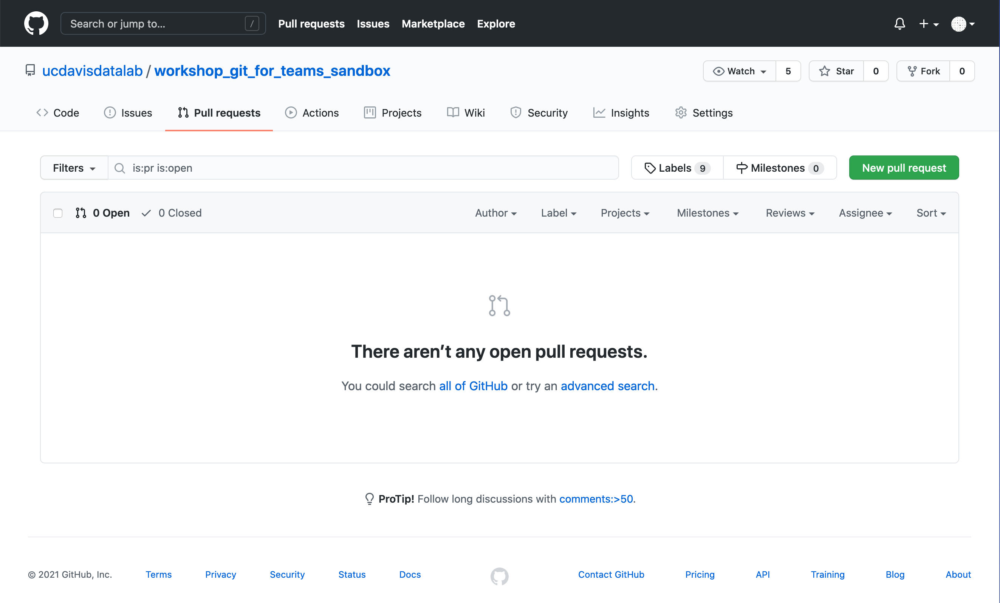
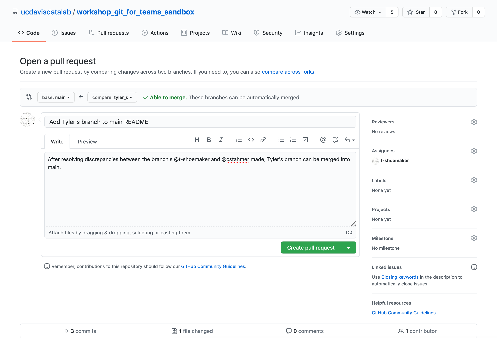
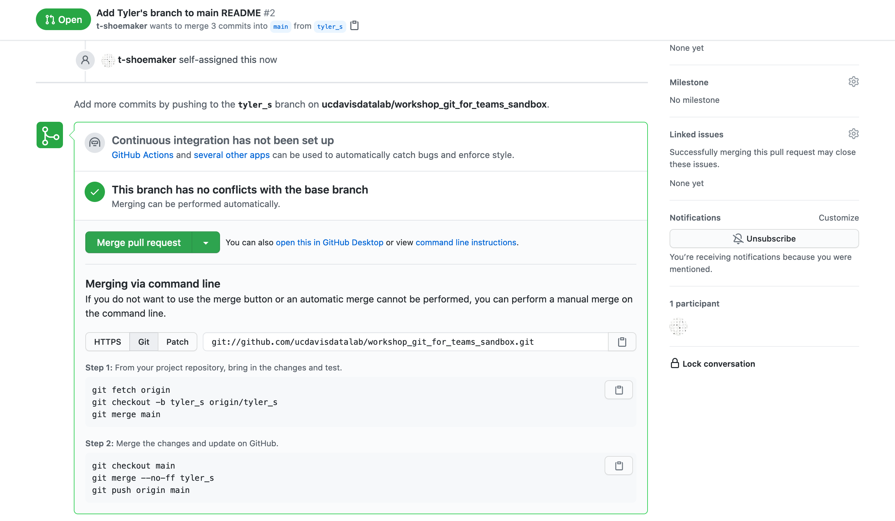

Open and Merge a Pull Request
=============================

This last part of the workshop will be demo-only. Now that some changes have 
been made to various branches, we're going to merge one of those branches back 
into the main branch using a **pull request** (the instructor will demo this so 
that we don't run into several conflicts). While we could simply merge a 
branch back into main, a pull request provides a formalized workflow for 
letting others know that we're proposing a change. In other words, a pull request 
is a review process, in which team members can review and discuss changes, make 
suggestions about how to improve changes or keep changes from breaking other 
parts of a project, and finally implement changes into a project's base 
repository.

We won't go over this much in the workshop itself, but note that many projects 
let members of the public open pull requests and contribute changes. If, for 
example, you notice a bug in R's `ggplot2` library and know how to fix it, you 
could **fork** the repository into your own GitHub account, make the necessary 
changes, and then open a pull request for the developers to review. If they 
accept your changes, your code will be incorporated into the project.

Opening a Pull Request
----------------------

You can open a pull request by clicking on the "Pull requests" tab.

From here, click on the green "New pull request."

Under the "Comparing changes" heading, select two branches from the drop down 
menus. The branch on the right will be the branch you're merging _into_ the 
branch on the left (i.e., the branch on the right is probably the one you've 
been working on). Once you've made your selection, GitHub will scan through the 
branches and identify any differences between them.

If the branches are able to be merged, click "Create pull request." You'll be 
taken to a new page, which looks quite similar to the what you'd see if you 
opened an issue. Just like an issue, a pull request should have a title and a 
description. You can assign yourself the role of making the request and, if 
applicable, you can ask someone to review the changes before you implement them 
(using the "Reviewers" function on the right).

Opening a pull request does not automatically implement a merge. Rather, the 
pull request stays open, providing a space for people to discuss the changes, 
make revisions if need be, etc.

Merging a Pull Request
----------------------

Once your team is happy with the changes, and once GitHub has verified that 
there are no conflicts between the branches, you can click "Merge pull request".
Alternatively, you can merge the pull request on the command line by following 
the instructions listed below.

For our purposes, we'll just click the button. GitHub will then register that 
the merge has been made:

If you went back to the main page, you'd see that your changes are implemented. 
From here, you can delete your branch (if you'd like) and then start on the 
next changes you'd like to make.